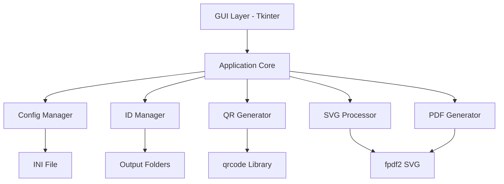

# QR Code Embedding Application - Implementation Plan

## Project Overview
A Python application that embeds unique QR codes into SVG images and generates PDF files for printing. Each QR code contains a unique URL for identification purposes.

## Requirements Summary

### Functional Requirements
- **Input**: SVG file, CSV with QR positions, number of pages, output folder
- **Output**: PDF files with embedded QR codes, organized by date
- **QR Content**: `https://qr.thermoelectrica.ru?id=<generated_id>`
- **Persistence**: Store configuration in INI file across restarts
- **ID Management**: Sequential IDs, date-based folders, automatic continuation

### Technical Requirements
- **GUI Framework**: Tkinter (built-in, cross-platform)
- **PDF Library**: fpdf2 for PDF generation and SVG reading
- **QR Library**: qrcode (or segno) for QR code generation
- **Error Correction**: Medium (M) level - 15% error correction
- **Architecture**: Separate core logic from GUI for easy CLI refactoring

### CSV Format
```csv
x_mm,y_mm,size_mm,rotation_deg
105.0,148.5,20.0,0
50.0,50.0,15.0,90
```
- **x_mm, y_mm**: Center position of QR code in millimeters from page top-left
- **size_mm**: QR code size (square) in millimeters
- **rotation_deg**: Rotation angle in degrees (0-360)

### Page Sizing
- User specifies desired page width in millimeters
- SVG is scaled to fit entire page width
- Page height is calculated from SVG aspect ratio
- QR positions in CSV are in mm relative to scaled page

### Output Structure
```
output_root/
  └── 2026-03-03/
      ├── 001-1709467200-1709467215.pdf
      ├── 002-1709467216-1709467231.pdf
      └── ...
```
- **Format**: `NNN-min_id-max_id.pdf`
- **NNN**: Zero-padded page number within day (001, 002, ...)
- **IDs**: Range of QR code IDs in that file
- **Starting ID**: If folder empty/absent, use today's Linux epoch timestamp

## Architecture Design



### Module Structure

```
qr-gen/
├── src/
│   ├── __init__.py
│   ├── core/
│   │   ├── __init__.py
│   │   ├── config_manager.py      # INI file handling
│   │   ├── id_manager.py          # ID generation and tracking
│   │   ├── qr_generator.py        # QR code generation
│   │   ├── svg_processor.py       # SVG scaling and processing
│   │   ├── pdf_generator.py       # PDF creation with SVG + QR
│   │   └── csv_parser.py          # Parse QR position CSV
│   ├── gui/
│   │   ├── __init__.py
│   │   ├── main_window.py         # Main Tkinter window
│   │   └── widgets.py             # Custom widgets
│   └── main.py                    # Entry point
├── tests/
│   ├── __init__.py
│   ├── test_config_manager.py
│   ├── test_id_manager.py
│   ├── test_qr_generator.py
│   ├── test_svg_processor.py
│   ├── test_pdf_generator.py
│   └── test_csv_parser.py
├── examples/
│   ├── sample.svg
│   └── positions.csv
├── config.ini                     # Auto-generated config
├── requirements.txt
├── setup.py
└── README.md
```

## Detailed Component Design

### 1. Configuration Manager (`config_manager.py`)

**Purpose**: Persist user settings across application restarts

**Functionality**:
- Read/write INI file using `configparser`
- Store: last SVG path, CSV path, output folder, page width, number of pages
- Provide defaults for first run
- Thread-safe operations

**Interface**:
```python
class ConfigManager:
    def __init__(self, config_path: str = "config.ini")
    def get(self, key: str, default: Any = None) -> Any
    def set(self, key: str, value: Any) -> None
    def save(self) -> None
    def load(self) -> None
```

### 2. ID Manager (`id_manager.py`)

**Purpose**: Generate unique sequential IDs and manage output folders

**Functionality**:
- Create date-based folder structure (YYYY-MM-DD)
- Scan existing files to determine next page number and ID
- Generate sequential IDs for QR codes
- Calculate ID ranges for filenames
- Use Linux epoch as starting ID for new days

**Interface**:
```python
class IDManager:
    def __init__(self, output_root: str)
    def get_next_page_info(self) -> tuple[int, int]  # (page_num, start_id)
    def generate_ids(self, count: int) -> list[int]
    def format_filename(self, page_num: int, min_id: int, max_id: int) -> str
    def get_output_path(self) -> Path
```

**Logic**:
1. Get current date folder path
2. List existing PDF files matching pattern
3. Parse filenames to extract max page number and max ID
4. Return next page number and next ID
5. If no files exist, use `int(time.time())` as starting ID

### 3. CSV Parser (`csv_parser.py`)

**Purpose**: Parse QR code position definitions

**Functionality**:
- Read CSV file with QR positions
- Validate format and values
- Return list of QR position objects

**Interface**:
```python
@dataclass
class QRPosition:
    x_mm: float          # Center X in mm
    y_mm: float          # Center Y in mm
    size_mm: float       # Size in mm (square)
    rotation_deg: float  # Rotation in degrees

class CSVParser:
    @staticmethod
    def parse(csv_path: str) -> list[QRPosition]
    @staticmethod
    def validate(positions: list[QRPosition], page_width_mm: float, page_height_mm: float) -> bool
```

### 4. QR Generator (`qr_generator.py`)

**Purpose**: Generate QR code images with unique IDs

**Functionality**:
- Generate QR codes with URL format
- Use Medium error correction
- Return QR as PIL Image or bytes
- Support different sizes

**Interface**:
```python
class QRGenerator:
    BASE_URL = "https://qr.thermoelectrica.ru?id="
    
    def __init__(self, error_correction: str = "M")
    def generate(self, qr_id: int, size_mm: float, dpi: int = 300) -> Image
    def generate_url(self, qr_id: int) -> str
```

**Implementation Notes**:
- Use `qrcode` library with PIL backend
- Calculate box_size based on desired mm size and DPI
- Return high-resolution image for PDF embedding

### 5. SVG Processor (`svg_processor.py`)

**Purpose**: Handle SVG scaling and coordinate conversion

**Functionality**:
- Read SVG file and extract dimensions/viewBox
- Calculate scaling factor for target page width
- Calculate page height from aspect ratio
- Convert mm coordinates to PDF points (1 mm = 2.83465 points)

**Interface**:
```python
class SVGProcessor:
    def __init__(self, svg_path: str, target_width_mm: float)
    def get_page_dimensions(self) -> tuple[float, float]  # (width_mm, height_mm)
    def get_aspect_ratio(self) -> float
    def mm_to_points(self, mm: float) -> float
    def get_svg_data(self) -> bytes
```

### 6. PDF Generator (`pdf_generator.py`)

**Purpose**: Create PDF files with embedded SVG and QR codes

**Functionality**:
- Use fpdf2 to create PDF
- Embed SVG as background
- Place QR codes at specified positions with rotation
- Support custom page dimensions
- Generate one PDF per page

**Interface**:
```python
class PDFGenerator:
    def __init__(self, svg_processor: SVGProcessor)
    def create_page(
        self,
        qr_positions: list[QRPosition],
        qr_images: dict[int, Image],
        output_path: str
    ) -> None
```

**Implementation**:
1. Create FPDF instance with custom page size
2. Add page
3. Embed SVG using `fpdf.image()` or SVG support
4. For each QR position:
   - Convert mm to points
   - Calculate position (center to top-left)
   - Apply rotation if needed
   - Embed QR image
5. Save PDF

### 7. Main Application Core

**Purpose**: Orchestrate all components

**Functionality**:
- Coordinate workflow between modules
- Handle batch generation
- Provide progress callbacks for GUI
- Error handling and validation

**Interface**:
```python
class QRCodeApp:
    def __init__(self, config_manager: ConfigManager)
    def generate_pages(
        self,
        svg_path: str,
        csv_path: str,
        page_width_mm: float,
        num_pages: int,
        output_root: str,
        progress_callback: Callable[[int, int], None] = None
    ) -> list[str]  # Returns list of generated file paths
```

**Workflow**:
1. Load and validate inputs
2. Parse CSV for QR positions
3. Process SVG and calculate page dimensions
4. Initialize ID manager
5. For each page:
   - Get next page number and starting ID
   - Generate QR codes for all positions
   - Create PDF with SVG + QR codes
   - Save to output folder
   - Update progress
6. Return list of generated files

### 8. GUI Layer (`main_window.py`)

**Purpose**: Tkinter interface for user interaction

**Components**:
- File selection buttons (SVG, CSV, output folder)
- Entry field for page width (mm)
- Entry field for number of pages
- Generate button
- Progress bar
- Status/log area
- Menu bar (File, Help)

**Layout**:
```
┌─────────────────────────────────────────┐
│ QR Code Embedding Application           │
├─────────────────────────────────────────┤
│ SVG File:     [path/to/file.svg] [Browse]│
│ CSV File:     [path/to/pos.csv] [Browse] │
│ Output Folder: [path/to/output] [Browse] │
│ Page Width (mm): [210.0]                 │
│ Number of Pages: [10]                    │
│                                          │
│              [Generate PDFs]             │
│                                          │
│ Progress: [████████░░░░░░░░░░] 40%       │
│                                          │
│ Status Log:                              │
│ ┌───────────────────────────────────────┐│
│ │ Ready to generate...                  ││
│ │ Loaded SVG: sample.svg                ││
│ │ Parsed 5 QR positions                 ││
│ │ Generated page 1/10                   ││
│ └───────────────────────────────────────┘│
└──────────────────────────────────────────┘
```

**Features**:
- Auto-load last used paths from config
- Validate inputs before generation
- Disable controls during generation
- Show real-time progress
- Display generated file paths
- Handle errors gracefully with dialogs

## Dependencies

### Required Python Packages
```
fpdf2>=2.7.0          # PDF generation with SVG support
qrcode[pil]>=7.4.0    # QR code generation
Pillow>=10.0.0        # Image processing
```

### Standard Library
- `tkinter` - GUI (built-in)
- `configparser` - INI file handling
- `csv` - CSV parsing
- `pathlib` - Path operations
- `datetime` - Date handling
- `time` - Epoch timestamp
- `re` - Filename parsing
- `dataclasses` - Data structures

## Implementation Phases

### Phase 1: Core Infrastructure
1. Set up project structure
2. Create requirements.txt and setup.py
3. Implement ConfigManager
4. Implement IDManager with file scanning logic
5. Implement CSVParser

### Phase 2: Content Generation
6. Implement QRGenerator
7. Implement SVGProcessor
8. Implement PDFGenerator
9. Create integration tests

### Phase 3: Application Core
10. Implement main QRCodeApp orchestration
11. Add error handling and validation


### Phase 4: GUI Development
13. Create main Tkinter window
14. Implement file selection dialogs
15. Add progress tracking
16. Connect GUI to core logic
17. Add status logging

### Phase 5: Testing & Documentation
18. Write unit tests for all modules
19. Create integration tests
20. Write user documentation
21. Add inline code documentation


## Testing Strategy

### Unit Tests
- **ConfigManager**: Read/write operations, defaults
- **IDManager**: ID generation, file parsing, folder creation
- **CSVParser**: Valid/invalid CSV formats
- **QRGenerator**: URL format, image generation
- **SVGProcessor**: Dimension calculation, scaling
- **PDFGenerator**: PDF creation, QR placement

### Integration Tests
- End-to-end generation with sample files
- Multi-page generation
- ID continuity across runs
- Date folder transitions

### Manual Testing
- GUI usability
- File selection dialogs
- Progress updates
- Error messages
- Config persistence

## Error Handling

### Input Validation
- SVG file exists and is valid
- CSV file exists and has correct format
- Output folder is writable
- Page width is positive
- Number of pages is positive integer
- QR positions are within page bounds

### Runtime Errors
- File I/O errors (permissions, disk space)
- Invalid SVG format
- QR generation failures
- PDF creation errors
- Graceful degradation with user feedback


## Technical Considerations

### Performance
- Generate QR codes in sequentially
- Cache SVG processing results
- Optimize PDF generation for large files

### Scalability
- Handle hundreds of pages
- Manage large SVG files
- Support high-resolution output

### Maintainability
- Clear separation of concerns
- Comprehensive documentation
- Type hints throughout
- Consistent error handling
- Logging for debugging

### Cross-Platform
- Use pathlib for path operations
- Test on Windows, Linux
- Handle different file system conventions
- Tkinter works on all platforms

## Key Design Decisions

1. **Tkinter for GUI**: Built-in, simple, cross-platform
2. **fpdf2 for PDF**: Good SVG support, actively maintained
3. **Medium QR error correction**: Balance between size and reliability
4. **MM-based positioning**: Natural for print applications
5. **Center-based coordinates**: Easier for designers to specify positions
6. **Date-based folders**: Organize output by generation date
7. **Epoch-based IDs**: Guaranteed uniqueness across all time
8. **INI for config**: Simple, human-readable, standard library support
9. **Separate core/GUI**: Easy to add CLI later
10. **Page width input**: Flexible for different paper sizes

## Success Criteria

- ✅ Generate PDFs with unique QR codes
- ✅ Embed QR codes at specified positions
- ✅ Maintain ID uniqueness and continuity
- ✅ Persist configuration across restarts
- ✅ User-friendly GUI
- ✅ Proper error handling
- ✅ Organized output structure
- ✅ Comprehensive tests
- ✅ Clear documentation
